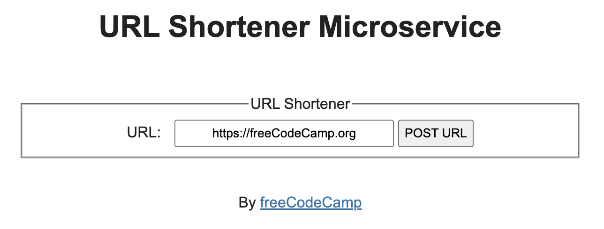

# URL Shortener Microservice

This is a solution to the [freeCodeCamp backend project](https://www.freecodecamp.org/learn/back-end-development-and-apis/back-end-development-and-apis-projects/url-shortener-microservice). Since for practice purposes only, I haven't connected to a database and dumped all the data into a global variable. Therefore, all the data will be lost if you shut off the server.

